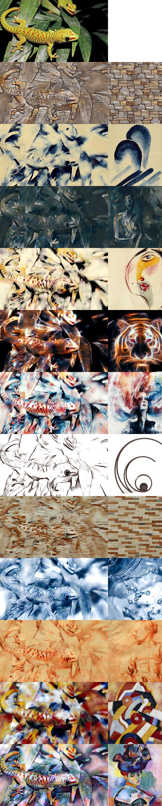

# Style transfer with whitening and coloring transforms

This is an implementation of [Universal Style Transfer via Feature Transforms](https://arxiv.org/abs/1705.08086).

## How to use this
1. Download pretrained decoders and encoder from [here](https://drive.google.com/drive/folders/1PIpmmvtNbjLQsHK4RePzJALzh8aWXEH8?usp=sharing).
2. Download `inference` folder.
3. See `inference/inference.ipynb` for an example of style transfer.

## Examples

## Requirements
1. tensorflow 1.12
2. numpy, Pillow

## Credit
This code is inspired by
1. [eridgd/WCT-TF](https://github.com/eridgd/WCT-TF)
2. [Yijunmaverick/UniversalStyleTransfer](https://github.com/Yijunmaverick/UniversalStyleTransfer)
